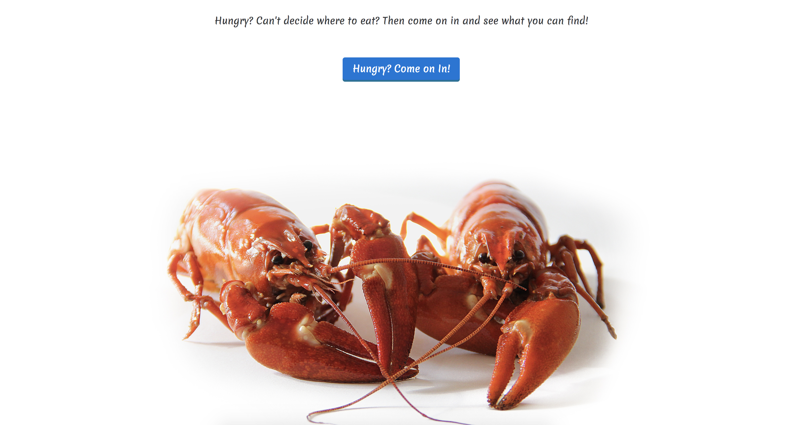
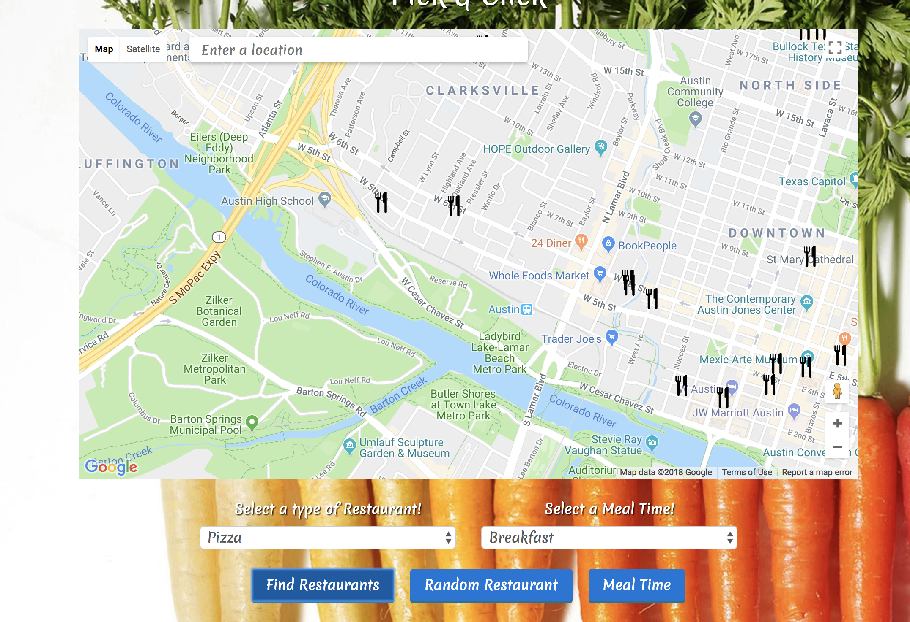

<strong>Random Eats</strong>

Random Eats is a restaurant application that uses the Google places API to retrieve restaurant information based on the users preferences. The user is able to pick a food preference and find a random restaurant or all restaurants in the area based on that food. They also can find all restaurants currently open in the area or all restaurants based on a meal time. (Breakfast, Lunch, Dinner, or Happy Hour).

The user can use the autocomplete search bar within the map to look for restaurants within a different location, neighborhood or anywhere in the world. The current map default is set to downtown Austin.

Tech Used:
javascript,
jQuery,
CSS,
HTML5,
Google Places API,
Bootstrap

